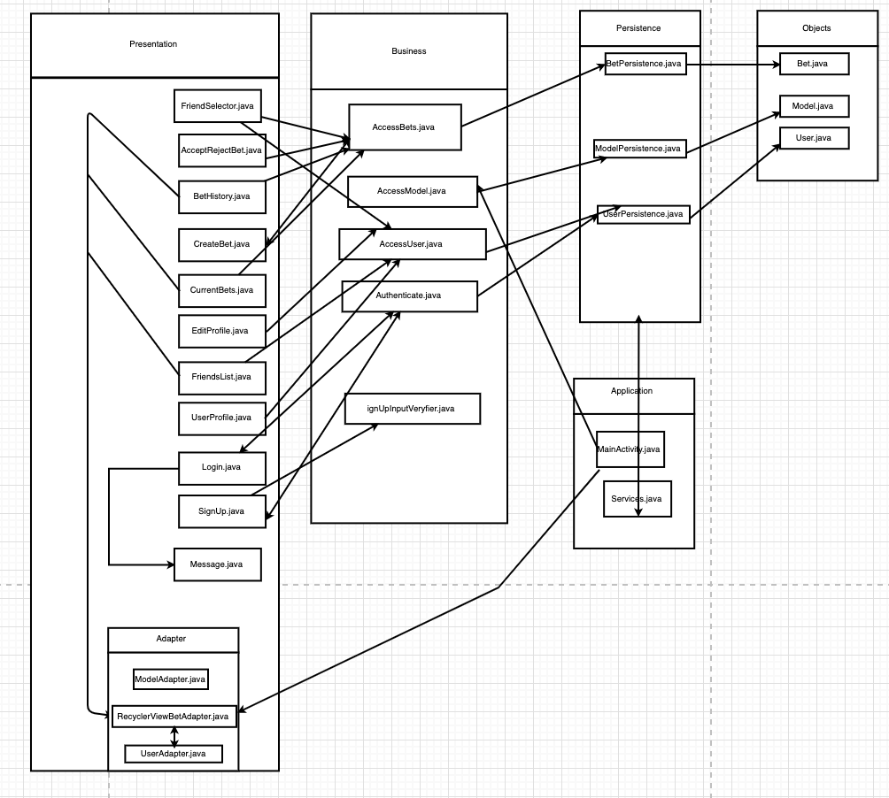

## Architecture of BetMates

The architecture of BetMates begins by dividing into 5 packages/layers. They are application, objects, business, persistence and presentation. 

Firstly, the application folder contains the MainActivity.java and Service.java classes. 

Secondly, the objects folder contains the 3 class objects used in BetMates, which are the User, Model and Bet object. 

Thirdly, there is the business package which contains the AccessUser.java, AccessModel.java, Authenticate.java, SignUpInputVerifier.java and AccessBet.java classes. This package allows access to the user, model and bet information. 

Fourthly, there is the persistence package. This package contains the BetPersistence.java, ModelPersistence.java and UserPersistence.java files which are the interfaces to the stub files. 

Finally, there is the presentation package which contains all of the activity files used for this iteration. The activity files are: UserProfile.java, BetHistory.java, CreateBet.java, CurrentBets.java, AcceptRejectBet.java, FriendsList.java, FriendSelector.java, Message.java, EditProfile.java, Login.java, and SignUp.java. There is also an adapter folder within business which contains the ModelAdapter.java, RecyclerViewBetAdapter.java and UserAdapter.java files.

The sketch below contains an overall view of the architecture of the BetMates application. It also displays the interactions between the different files.

